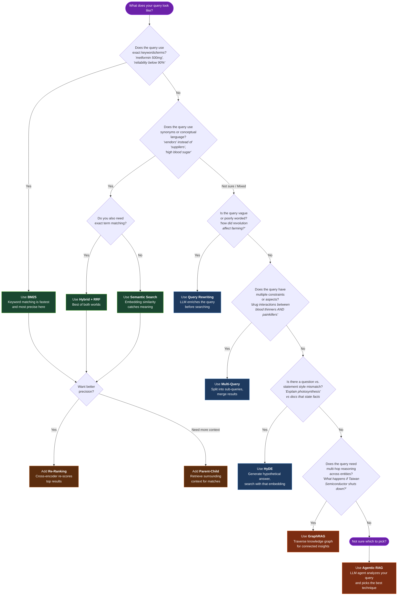

# RetrieverBench

An interactive playground for learning, testing, and comparing document retrieval techniques used in modern RAG (Retrieval-Augmented Generation) systems.

Pick a dataset, pick a retrieval technique, run a query, and see exactly what got retrieved, why, and how fast. The core feature is **side-by-side comparison** — running the same query through two different techniques to see why one finds better results than the other.

## Why RetrieverBench?

- **Learning tool** — for engineers preparing for ML/AI interviews who want to understand retrieval techniques hands-on
- **Benchmarking tool** — for comparing retrieval strategies on real data with concrete metrics
- **Visual explanations** — every retrieved chunk comes with a plain-English explanation of WHY it was selected

## How It Works — The RAG Retrieval Pipeline

Every retrieval technique in RetrieverBench fits into one of three pipeline stages. Some techniques enhance the **query before search**, some perform the **actual search**, and some **improve results after search**.

```mermaid
flowchart LR
    Q["User Query"] --> PRE

    subgraph PRE ["PRE-RETRIEVAL (Query Enhancement)"]
        direction TB
        QR["Query Rewriting\n<i>LLM clarifies vague queries</i>"]
        MQ["Multi-Query\n<i>Split into sub-queries</i>"]
        HY["HyDE\n<i>Generate fake answer,\nsearch with its embedding</i>"]
    end

    subgraph RET ["RETRIEVAL (Core Search)"]
        direction TB
        BM["BM25\n<i>Keyword matching</i>"]
        SE["Semantic Search\n<i>Embedding similarity</i>"]
        HB["Hybrid + RRF\n<i>Merge BM25 + Semantic</i>"]
        GR["GraphRAG\n<i>Knowledge graph traversal</i>"]
    end

    subgraph POST ["POST-RETRIEVAL (Result Enhancement)"]
        direction TB
        RR["Re-Ranking\n<i>Cross-encoder re-scoring</i>"]
        PC["Parent-Child\n<i>Expand to full context</i>"]
        SC["Semantic Chunking\n<i>Topic-aware boundaries</i>"]
    end

    PRE --> RET
    RET --> POST
    POST --> R["Ranked Results\nwith Explanations"]

    style PRE fill:#1e3a5f,stroke:#4a90d9,color:#ffffff
    style RET fill:#1a4731,stroke:#38b000,color:#ffffff
    style POST fill:#5c2d0e,stroke:#e07b39,color:#ffffff
    style Q fill:#6b21a8,stroke:#a855f7,color:#ffffff
    style R fill:#6b21a8,stroke:#a855f7,color:#ffffff
```



> **Agentic RAG** (Technique 11) sits above the entire pipeline — it's an LLM agent that analyzes your query and **automatically picks** which combination of the above techniques to use.

## Which Technique Should I Use?

Use this decision flowchart to pick the right retrieval technique for your query type:



**Color legend:**
- **Green** = Foundation retrieval (BM25, Semantic, Hybrid)
- **Blue** = Pre-retrieval query enhancement (Rewriting, Multi-Query, HyDE)
- **Orange** = Post-retrieval enhancement (Re-Ranking, Parent-Child) and Advanced (GraphRAG, Agentic)
- **Purple** = Start / decision points

## Retrieval Techniques

RetrieverBench implements 11 retrieval techniques, ordered from foundational to advanced:

### Phase 1 — Foundation
| # | Technique | What It Does |
|---|-----------|-------------|
| 1 | **BM25** | Sparse keyword retrieval — the baseline everything gets compared against |
| 2 | **Dense/Semantic Search** | Embeddings + cosine similarity via ChromaDB |
| 3 | **Hybrid Search + RRF** | Combines BM25 + semantic, merges results with Reciprocal Rank Fusion |

### Phase 2 — Pre-Retrieval Enhancements
| # | Technique | What It Does |
|---|-----------|-------------|
| 4 | **Query Rewriting** | LLM enriches/clarifies the query before search |
| 5 | **Multi-Query Decomposition** | Splits complex queries into sub-queries, merges results |
| 6 | **HyDE** | Generates a hypothetical answer, searches with that embedding |

### Phase 3 — Post-Retrieval & Chunking
| # | Technique | What It Does |
|---|-----------|-------------|
| 7 | **Re-Ranking** | Cross-encoder re-scores initial retrieval results |
| 8 | **Parent-Child Chunking** | Index small chunks, retrieve parent (larger context) chunks |
| 9 | **Semantic Chunking** | Break documents at topic boundaries instead of fixed sizes |

### Phase 4 — Advanced
| # | Technique | What It Does |
|---|-----------|-------------|
| 10 | **GraphRAG** | Knowledge graph retrieval via Neo4j |
| 11 | **Agentic RAG** | LLM agent dynamically selects which technique(s) to use |

## Tech Stack

| Layer | Technology |
|-------|-----------|
| Backend | FastAPI (Python 3.11+) |
| Vector DB | ChromaDB (local, no external deps) |
| Graph DB | Neo4j (Docker) — for GraphRAG module |
| Embeddings | `all-MiniLM-L6-v2` via sentence-transformers (384-dim, CPU-friendly) |
| Re-Ranking | `cross-encoder/ms-marco-MiniLM-L6-v2` |
| Sparse Retrieval | `rank-bm25` (pure Python) |
| LLM | NVIDIA NIM (Llama 3.1 70B Instruct) |
| Frontend | Next.js 14 + Tailwind CSS + Shadcn/ui |
| Containerization | Docker Compose |

## Datasets

Three built-in datasets, each highlighting different retrieval strengths:

### Supply Chain
Documents about suppliers, components, products, warehouses, and retailers.

| Query | Best Technique | Why |
|-------|---------------|-----|
| "Which suppliers have reliability below 90%?" | BM25 | Exact property matching |
| "What happens if Taiwan Semiconductor shuts down?" | GraphRAG | Multi-hop reasoning needed |
| "Find vendors in China" | Semantic | "vendors" ≈ "suppliers" |

### Healthcare
Medical documents about drugs, prescriptions, and treatment protocols.

| Query | Best Technique | Why |
|-------|---------------|-----|
| "Side effects of metformin 500mg" | BM25 | Exact drug name + dosage |
| "Treatment options for high blood sugar" | Semantic | "high blood sugar" ≈ "hyperglycemia" |
| "Drug interactions between blood thinners and painkillers" | Multi-Query | Two separate aspects |

### Wikipedia (General Knowledge)
Curated articles across science, history, tech, and geography.

| Query | Best Technique | Why |
|-------|---------------|-----|
| "How did the industrial revolution affect farming?" | Query Rewriting | Vague query needs enrichment |
| "Tall art deco buildings built in New York in the 1930s" | Multi-Query | Multiple constraints |
| "Explain photosynthesis" | HyDE | Question vs statement style mismatch |

## Getting Started

### Prerequisites

- Docker and Docker Compose
- Node.js 18+ (for frontend)
- NVIDIA NIM API key (for LLM-powered techniques)

### Setup

1. **Clone the repository**
   ```bash
   git clone https://github.com/jarharsh1/retrieval-lab.git
   cd retrieval-lab
   ```

2. **Configure environment variables**
   ```bash
   cp .env.example .env
   # Edit .env and add your NVIDIA_NIM_API_KEY
   ```

3. **Start backend services**
   ```bash
   docker compose up -d
   ```

4. **Start frontend** (in a separate terminal)
   ```bash
   cd frontend && npm install && npm run dev
   ```

5. **Verify everything is running**
   ```bash
   docker compose ps
   ```

### Quick Test

```bash
curl -X POST http://localhost:8000/api/retrieve \
  -H "Content-Type: application/json" \
  -d '{"query": "suppliers in China", "dataset": "supply_chain", "technique": "bm25", "top_k": 5}'
```

## API

### POST /api/retrieve

Run a single retrieval query.

```json
{
  "query": "Which suppliers have reliability below 90%?",
  "dataset": "supply_chain",
  "technique": "bm25",
  "top_k": 5
}
```

Returns: retrieved chunks with scores, latency_ms, technique_info, and per-chunk explanations.

### POST /api/compare

Compare two techniques side by side on the same query.

```json
{
  "query": "Find vendors in China",
  "dataset": "supply_chain",
  "techniques": ["bm25", "semantic"],
  "top_k": 5
}
```

Returns: results from both techniques side by side.

### GET /api/datasets

List available datasets and their metadata.

### POST /api/upload

Upload a custom dataset for retrieval testing.

## Project Structure

```
RetrieverBench/
├── backend/
│   ├── main.py                     # FastAPI app entry point
│   ├── config/settings.py          # Pydantic settings, env config
│   ├── datasets/                   # Dataset files + loader
│   ├── retrievers/                 # Core — each technique = one file
│   │   ├── base.py                 # BaseRetriever abstract class
│   │   ├── bm25.py                 # Technique 1: BM25
│   │   ├── semantic.py             # Technique 2: Dense search
│   │   ├── hybrid.py               # Technique 3: Hybrid + RRF
│   │   ├── query_rewriter.py       # Technique 4: Query rewriting
│   │   ├── multi_query.py          # Technique 5: Multi-query
│   │   ├── hyde.py                 # Technique 6: HyDE
│   │   ├── reranker.py             # Technique 7: Re-ranking
│   │   ├── parent_child.py         # Technique 8: Parent-child chunks
│   │   ├── semantic_chunk.py       # Technique 9: Semantic chunking
│   │   ├── graph_rag.py            # Technique 10: GraphRAG
│   │   └── agentic.py              # Technique 11: Agentic RAG
│   ├── routes/                     # API endpoints
│   └── utils/                      # Embeddings, LLM client, metrics
├── frontend/                       # Next.js 14 + Tailwind + Shadcn/ui
├── notebooks/                      # Jupyter notebooks explaining the math
├── docker-compose.yml
└── .env.example
```

## Development

### Adding a New Retriever

Every retriever inherits from `BaseRetriever` and implements three methods:

```python
class MyRetriever(BaseRetriever):
    def index(self, documents: list[Document]) -> None:
        """Index documents for retrieval."""
        ...

    def retrieve(self, query: str, top_k: int = 5) -> list[RetrievalResult]:
        """Retrieve relevant documents with explanations."""
        ...

    def get_info(self) -> TechniqueInfo:
        """Return metadata about this technique."""
        ...
```

Each `RetrievalResult` contains: `document`, `score`, `rank`, `metadata`, and `explanation` (a plain-English string explaining WHY this document was retrieved).

### Commands Reference

```bash
# Start all services
docker compose up -d

# Start backend only (dev mode)
cd backend && uvicorn main:app --reload --port 8000

# Start frontend
cd frontend && npm run dev

# View backend logs
docker compose logs -f backend

# Check service status
docker compose ps
```

## License

MIT
